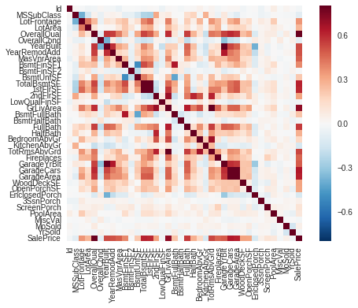

## Project Introduction
This project is for the Kaggle Competition [House Prices: Advanced Regression Techniques](https://www.kaggle.com/c/house-prices-advanced-regression-techniques)
using the Ames Housing dataset which contains 79 variables for almost all aspects of the homes in Ames, Iowa, to predict the final house sale price.

## Glance at the data

### Step 1.
Import libraries, load data, check the correlations between each variable.

        import pandas as pd
        import numpy
        from sklearn import metrics
        import matplotlib.pyplot as plt
        from scipy.stats import skew
        from sklearn import linear_model
        from sklearn.cross_validation import train_test_split
        import seaborn as sns

        training = pd.read_csv('./train.csv')
        testing = pd.read_csv('./test.csv')
        relationship = training.corr()
        sns.heatmap(relationship, vmax=1.0, square = True)

## Cleaning and filling missing part

### Step 2. 
Drop some useless variables. We can see that many variables like 'OverallCond', 'BsmtHalfBath', etc., contribute little to the SalePrice variable, the final prediction goal of this project. Therefore, I drop those variables. Some variables have high correlation with others, like 'GarageArea' with 'GarageCars'. After I examine the data_description.txt file for further variables explanation, I drop the correlated variables to avoid multicollinearity.

        training_label = training['SalePrice']
        training_label = numpy.log1p(training_label)  #transformed into normal distribution
        training = training.drop(['SalePrice'], axis = 1) 
        all_data = pd.concat((training,testing),axis = 0)

        all_data_f_drop = ['GarageYrBlt', 'PoolQC', 'MiscFeature', 'GarageCars','GarageFinish',
                           'GarageCond','GarageQual','BsmtFinType1','BsmtFinType2','MoSold']
        for f_drop in all_data_f_drop:
            all_data = all_data.drop(f_drop, axis = 1)

Here I concatenate all training dataset and testing dataset, one reason is for better visualizing the data to get more information, the other is to make sure both the training dataset and testing dataset will get the same dimension after dummy transformation.

### step 3. 
Check if there is any missing data

        number_missing = all_data.isnull().sum().sort_values(ascending=False)
        number_missing = number_missing[number_missing!=0]
        percentage_missing = number_missing/all_data.shape[0]
        missing_data = pd.concat([number_missing, percentage_missing], axis = 1, keys=['number','percentage'])

### Step 4. 
Let's examine the train.csv data file and the data_description.txt which contains full description of each column, it is easily found out that some missing data "NA" does not really mean "missing", instead, they means "None". For example, "NA" in feature "Alley" just mean "No Alley Access". Some features’ "NA" means 0 or "Other", while others I use the mean value or the most frequent value of that variable to fill the "NA". The variables "Alley", and "Fence" has over 80% missing value, and variable "FireplaceQu" has almost 50% of missing value. Based on the mean square error later on, deleting these three variables will improve the accuracy, therefore, I drop these three variables too.

        all_data_f_drop = ['Alley', 'Fence', 'FireplaceQu']
        for f_drop in all_data_f_drop:
            all_data = all_data.drop(f_drop, axis = 1)
        all_data_f_zero = ['MasVnrArea','BsmtFullBath','BsmtFinSF1','TotalBsmtSF',
                          'GarageArea']
        for f_zero in all_data_f_zero:                  
            all_data[f_zero] = all_data[f_zero].fillna(0)
        all_data_f_other = ['Exterior2nd','SaleType','Exterior1st']
        for f_other in all_data_f_other:
            all_data[f_other] = all_data[f_other].fillna('Other')
        all_data_f_mean=['LotFrontage','BsmtUnfSF']
        for f_mean in all_data_f_mean:
            all_data[f_mean] = all_data[f_mean].fillna(numpy.mean(testing[f_mean]))
        all_data_f_frequent = ['MSZoning','KitchenQual','Utilities','Functional']
        for f_frequent in all_data_f_frequent:
            all_data[f_frequent] = all_data[f_frequent].fillna(all_data[f_frequent].value_counts().index[0])
        na_column = all_data.isnull().sum()
        na_column = list(na_column[na_column!=0].index)
        for x in na_column:
            all_data[x]=all_data[x].fillna('None')    

### Step 5. 
Log transform some skewed numeric variables, dummy transform the category data, then normalize some variables which contains large range to have 0 mean and 1 std. These steps are to help the linear regression model get a better performance.

        numeric_var = all_data.dtypes[all_data.dtypes != "object"].index
        skewed_var = training[numeric_var].apply(lambda x: skew(x.dropna())) #compute skewness
        skewed_var = skewed_var[skewed_var > 0.75]
        skewed_var = skewed_var.index
        all_data[skewed_var] = numpy.log1p(all_data[skewed_var])

        all_data = pd.get_dummies(all_data)

        scale_f_list = ['LotFrontage','LotArea','MasVnrArea',
        'BsmtFinSF1','BsmtUnfSF','TotalBsmtSF','2ndFlrSF',
        'GrLivArea','TotRmsAbvGrd','GarageArea','WoodDeckSF','EnclosedPorch','3SsnPorch',
        'ScreenPorch','PoolArea']
        for feature in scale_f_list:
            all_data[feature] = preprocessing.scale(all_data[feature])

## Train linear regression model and perform prediction

### Step 6. 
Split the all_data into training set and testing set, then further split 30% of training set into validation set. I am going to use sklearn.linear_model.Ridge. The validation set is used to select the right value for parameter alpha, for regularization to avoid overfitting.

        line = training.shape[0]
        training = all_data[:line]
        testing = all_data[line:]    
        training_x, validation_x, training_y, validation_y = train_test_split(training, training_label, test_size=0.3,random_state=10)

        error_rate=[]
        alphas = [0.01,0.06,0.1,1,1.6,2,5,8,10,12,15,20]
        for alpha in alphas:
            linearM = linear_model.Ridge(alpha)
            linearM.fit(training_x, training_y)
            predicted_y = linearM.predict(validation_x)
            error_rate.append(metrics.mean_squared_error(validation_y,predicted_y))
        plt.plot(alphas,error_rate)
        min_error, idx = min((min_error, idx) for (idx, min_error) in enumerate(error_rate))
        print('alpha and smallest error',alphas[idx], min_error)

### Step 7. 
Predicting the sale price using the testing dataset

        linearM = linear_model.Ridge(alphas[idx])
        linearM.fit(training_x, training_y)

        predicted_y_test = linearM.predict(testing)
        predicted_y_test = numpy.expm1(predicted_y_test)
        testing_y = pd.DataFrame(predicted_y_test, columns = ['SalePrice'])
        testing_y.index += 1461
        testing_y.index.name = 'Id'
        testing_y.to_csv('salePrice_prediction_submission.csv', sep=',')
        
## Some thoughts
Here I only tried basic linear regression model with regularization. Participants in Kaggle Community share some other techniques like Random Forest, and Gradient Boosting, also using PCA to avoid the multicollinearity, and fancy visualization to explore more about the data, like boxplot. I will try their methods and see how I can improve my version.

