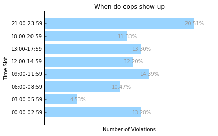
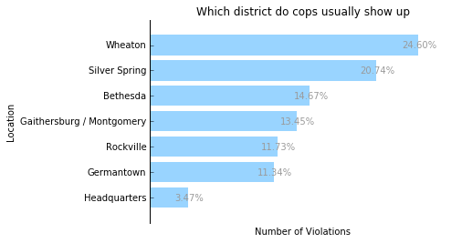
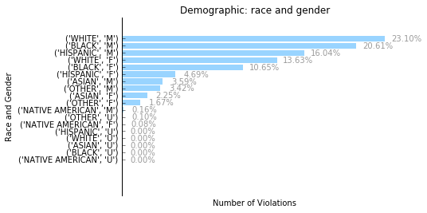

## Project Introduction
I found a [dataset](https://catalog.data.gov/dataset/traffic-violations-56dda) from data.gov about the electronic traffic violations issued from 2012-01-01 to 2017-03-21 in Montgomery County in Maryland. I think it would be interesting to see when and where cops usually show up in the county, and what type of person or car contribute the most violations. After all, Maryland is one of the hardest states to get a driver's license. Maybe something interesting would be discovered.

## Glance at the data
Data.gov provides several different formats for the dataset: CSV, RDF, JSON, and XML. The JSON and XML files are too large to be opened by the browser. Considering the memory limits, I use CSV this time as the data source. I would try other methods to open large JSON or XML files without exceeding Python's memory next time. (This article would keep updating.)

To avoid exceeding python's memory when loading the whole CSV file into a pandas dataframe object, I use the "chunksize" parameter to load the file separately. 

```
import pandas as pd
import numpy as np
import matplotlib.pyplot as plt
import collections
df_data = pd.read_csv('./Traffic_Violations_clean.csv',sep=',', header=0, chunksize = 500000,dtype = str)
```

df_data is a pandas TextFileReader, which is an iterator and can only be **iterated once**. Each chunk of it is a pandas dataframe.

## Clean Data
After glancing at the CSV file, I want to extract the fields such as date of stop, time of stop, agency name, violation descriptions, car information, and demographic information.

```
date_of_stop = pd.Series()
time_of_stop = {}
time_slot_list=['00:00-02:59','03:00-05:59', '06:00-08:59','09:00-11:59','12:00-14:59',
                '13:00-17:59','18:00-20:59','21:00-23:59']
for time_slot in time_slot_list:
      time_of_stop[time_slot]=0             
sub_agency = {}
agency_dict = {'1st':'Rockville','2nd':'Bethesda','3rd':'Silver Spring','4th':'Wheaton',
'5th':'Germantown','6th':'Gaithersburg / Montgomery','Headquarters':'Headquarters'}
description = {}
vehicle = {}
year = {}
make = {}
year_make ={}
color = {}
race = {}
gender = {}
race_gender={}
driver_license_state = {}

for df in df_data:
    #put all date into a pandas series
    date_of_stop = date_of_stop.append(df['Date Of Stop'])
    
    len_df = len(df)
    for item in df['SubAgency']:
        agency_num = item.split()[0]
        if agency_dict[agency_num] in sub_agency:
            sub_agency[agency_dict[agency_num]] += 1
        else:
            sub_agency[agency_dict[agency_num]] = 1
    #seperate time into 7 different perieds
    for time in df['Time Of Stop']:
        hour_slot = time.split(':')[0]
        hour_group = int(np.interp(int(hour_slot), [0, 24], [0,8])) #every 3 hour would become a slot       
        time_of_stop[time_slot_list[hour_group]] +=1

        
    
    for i in range(len_df):
        #get vehicle info: year, make, model
        year_make = (df['Year'][i],df['Make'][i])
        if year_make in vehicle:
            vehicle[year_make] += 1
        else:
            vehicle[year_make]  = 1
        #get vehicle year info
        if df['Year'][i] in year:
            year[df['Year'][i]] += 1
        else:
            year[df['Year'][i]] = 1
        #get vehicle make info
        if df['Make'][i] in make:
            make[df['Make'][i]]+=1
        else:
            make[df['Make'][i]] = 1       
        #get vehicle color info:
        if df['Color'][i] in color:
            color[df['Color'][i]] += 1
        else:
            color[df['Color'][i]] = 1
        #Race info
        if df['Race'][i] in race:
            race[df['Race'][i]] += 1
        else:
            race[df['Race'][i]] = 1
        #Gender:
        if df['Gender'][i] in gender:
            gender[df['Gender'][i]]+=1
        else:
            gender[df['Gender'][i]] = 1
        
        if (df['Race'][i],df['Gender'][i]) in race_gender:
            race_gender[(df['Race'][i],df['Gender'][i])] += 1
        else:
            race_gender[(df['Race'][i],df['Gender'][i])] = 1
        #which state is the driver license issued
        if df['DL State'][i] in driver_license_state:
            driver_license_state[df['DL State'][i]]+=1
        else:
            driver_license_state[df['DL State'][i]] = 1
#change the string time to actual datetime type            
date_of_stop = pd.to_datetime(date_of_stop)      
sum_violations = sum(time_of_stop.values())               
```

## Data Visualization
I defined a function to create horizontal bar chart to plot the data using Python's Matplotlib library. The processed data is stored as Python dictionary. The data is sorted by key or value first. In order to have a simple and clear bar chart, I remove the top, left, and bottom frame, keep the left ytick, and show the percentage value for each bar instead of using xtick. 

```
def horizontal_bar(dict_data, orderby,ylabel,title,sum_violations=sum_violations):
    #using collections package to order a dictionary 
    if orderby=='key':
        sorted_data = collections.OrderedDict(sorted(dict_data.items()))
    else:
        sorted_data = collections.OrderedDict(sorted(dict_data.items(),key=lambda x:x[1]))
    
    fig, ax = plt.subplots()
    rects = ax.barh(range(len(sorted_data)),sorted_data.values(), align='center',color='#99D4FF',edgecolor='none',tick_label=sorted_data.keys())        
    ax.get_xaxis().set_ticks([])
    ax.yaxis.tick_left()
    ax.spines['top'].set_visible(False)
    ax.spines['bottom'].set_visible(False)
    ax.spines['right'].set_visible(False)
    ax.set_xlabel('Number of Violations')
    ax.set_ylabel(ylabel)
    ax.set_title(title)
    for rect in rects:
        width = int(rect.get_width())
        xloc = width+1000
        yloc = rect.get_y()+rect.get_height()/2.0
        bar_label=width/sum_violations*100
        bar_label = "{0:.2f}%".format(bar_label)
        plt.text(xloc,yloc,bar_label,horizontalalignment='center',verticalalignment='center', color='0.6')
    plt.show()    
```

Now let’s plot some horizontal bar charts.

```
horizontal_bar(time_of_stop,'key','Time Slot','When do cops show up')   
```



```
horizontal_bar(sub_agency,'value','Location','Which district do cops usually show up')  
```



```
horizontal_bar(race_gender,'value','Race and Gender','Demographic: race and gender') 
```




## Some thoughts
There are some fields that I have not fully utilized yet, such as the violation descriptions, which contain a short sentence about why the driver was given a ticket. It would be interesting to find out what is the most common reason of getting a ticket, or will the most common reason differs among different genders. It requires the Natural Language Processing techniques. I would keep updating this article.
