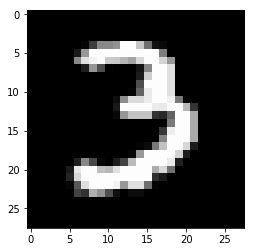
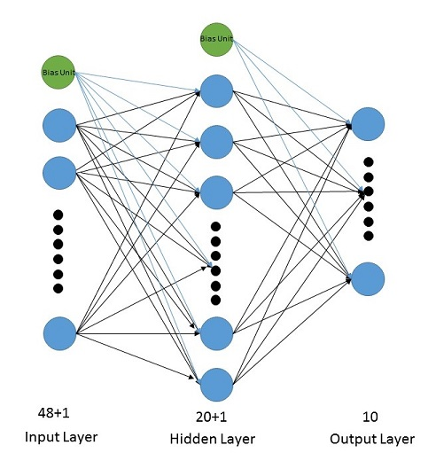

## Project Introduction
I finished the Machine Learning course taught by Professor Andrew Ng on Coursera. Professor Ng explained how to write a backpropagation algorithm with logistic activation function to train the Neutral Network, and how to use forward propagation to perform the prediction. The original tutorial was on Matlab. I think it would be cool to rewritten it in Python. The [Digit Recognizer competition](https://www.kaggle.com/c/digit-recognizer) on Kaggle looks like a good project to me to practice what I have learned from the course. This project is to classify handwritten digits using the famous [MNIST](http://yann.lecun.com/exdb/mnist/index.html) data. 

In general, I designed a simple Neural Network with one input layer, one hidden layer, and one output layer, with Sigmoid function as the activation function. I defined a cost function with gradient descent in feedforward propagation and backpropagation algorithm. Then I select advanced optimization function from scipy.optimize.fmin_l_bfgs_b to help me minimize the cost function in order to train the Neural Network. This optimization procedures return the parameters Theta, which can be applied in final prediction.

I know there are many advanced libaries now like TensorFlow, Keras, etc. that will make training Neural Network less painful. My goal here is to write down and practice what I have learned in the Machine Learning class, and understand what is the mathematical procedures behind the scene.

## Glance at the data

### Step1. Load data, get some idea of it
The data files are gray-scale images of hand-written digits from 0-9. Each image is 28 pixel * 28 pixel. The training dataset has 42000 rows and 785 columns, the extra one column is for label. The testing dataset has 28000 rows and 784 columns without the extra "label" column. 
    
    import pandas as pd
    import numpy
    from scipy.optimize import fmin_l_bfgs_b
    from sklearn.preprocessing import Normalizer
    from sklearn.decomposition import PCA
    from sklearn import preprocessing
    import matplotlib.pyplot as plt


    #read training dataset and testing datast into panda dataframe
    training_data_path = './input/train.csv'
    testing_data_path = './input/test.csv'
    training = pd.read_csv(training_data_path)   
    testing_data = pd.read_csv(testing_data_path)
    testing_data = testing_data.values

    training.shape
    testing_data.shape
    
The example picture looks like this:
    
    some_digits = training.ix[9,1:].values
    some_digits = some_digits.reshape(28,28)
    plt.imshow(some_digits, cmap='gray')
    


### step 2. Normalize Data

I normalize the data in order to perform PCA to reduce the data dimention, since I will use the column number of the data file as the input layer units. The original column number is 784+1, meaning there would be 784 units on input layer. I have tried using all column as input units. But it just easiy strike my laptop when I run the program. Therefore I decided to use PCA to speed things up and reduce the usage of memory, also save my poor laptop.

    training_x = training.drop(['label'],axis='columns').values
    training_y = training['label'].values 
    normalizer = Normalizer().fit(training_x)
    training_x = normalizer.transform(training_x)
    testing_data = normalizer.transform(testing_data)

    pca = PCA(n_components=0.8, whiten=True).fit(training_x)
    training_x = pca.transform(training_x)
    testing_data = pca.transform(testing_data)
    training_x.shape
    testing_data.shape
    
After PCA, the column number is reduced to 48. In this way I only have 48 units in the input layer instead of 784. I would like to explain more why this would make a huge difference in computation speed.

### Step3. Design a Neural Network layout
Here I use a simple Neural Network with only one hidden layer. The structure is like this:



Each picture has totally 784 pixels, which is also the column number in the data files. After PCA (Principle Component Analysis), the dimension is reduced to 48. Therefore the input layer has 48 units. I designed 20 units in the hidden layer. The more unites in the hidden layer or the more hidden layer, the better for the algorithm performance, but also the more computational expensive. Since there are 0-9 totally 10 different digits for recognition, the output layer has 10 units.
I will use feedforward propagation with logistic activation function for Neural Network to perform the prediction, and the backpropagation to train the Neural Network. Since the math formula does not look good in markdown file, I am not going to list them. 

Suppose X is a row vector with 48 elements, representing one image. These 48 elements fit in the input layer. We need a type of calculation to get the value of each of the 20 units in the hidden layer based on the input value. Let's name it Theta1 for the parameter working on this procedure. Theta1 is a matrix with the shape 20*(48+1). Plus one here means adding a bias unit whose value is 1 to the X. 

There needs another parameter Theta2 to map the value of units in hidden layer to the output layer. Theta2 is a 10*(20+1) matrix. Plus one also means adding a bias unit whose value is 1 to the hidden layer units.

To continue the Neutral Network training procedure, I need some helper functions:

1. The activation function: Logistic function, also called Sigmoid function. The returned value of it is within the range [0,1]
    ```
    def sigmoid(z):
        
        return 1/(1+numpy.exp(-z))
    ```
2. The cost function: containing gradient descent in feedforward propagation and backpropagation algorithm. It returns the cost function and the gradient.

    ```
    def nnCostFunction(nn_params, input_layer_size, hidden_layer_size,num_labels, X, y, lda):  
    
        #part1: cost function:
    
        Theta1 = numpy.reshape(nn_params[:hidden_layer_size*(input_layer_size+1)], (hidden_layer_size, input_layer_size+1), order='c')
        Theta2 = numpy.reshape(nn_params[hidden_layer_size*(input_layer_size+1):],(num_labels, (hidden_layer_size+1)),order='c')       
        (m, n) =  X.shape
        J = 0
        Theta1_grad =  numpy.zeros(Theta1.shape)
        Theta2_grad =  numpy.zeros(Theta2.shape)

        a1 = numpy.append(numpy.ones((m,1)), X, axis=1)  # m * (n+1)
        binary_y = numpy.zeros((m,num_labels))   #m*l

        for i in range(m): 
            z2 = numpy.dot(a1[i],Theta1.T) #1*(n+1) * (n+1)*h =1*h
            a2 = sigmoid(z2)        
            a2 = numpy.append(1, a2)    #1*(h+1)

            z3 = numpy.dot(a2, Theta2.T)    #1*(h+1) * (h+1)*l = 1*l
            a3 = sigmoid(z3)
            binary_y[i,int(y[i])] = 1
            J += numpy.dot(binary_y[i],numpy.log(a3).T)+numpy.dot((1-binary_y[i]),numpy.log(1-a3).T)


            #for calculating gradient:
            delta3 = a3 - binary_y[i]   #1*l
            delta2 = numpy.dot(delta3,Theta2[:,1:])*sigmoid(z2)*(1-sigmoid(z2))  # 1*l * l*h=1*h
            Theta2_grad += numpy.dot(delta3[numpy.newaxis,:].T,a2[numpy.newaxis,:]) # l*1 * 1*(h+1)= l*(h+1)
            Theta1_grad += numpy.dot(delta2[numpy.newaxis,:].T, a1[i,numpy.newaxis])  # h*1 * 1*(n+1) = h*(n+1)
        J = (-1/m)*J

        #part 2: for regularization
        no_bias_theta1 = Theta1[:,1:]   #h*m
        no_bias_theta2 = Theta2[:,1:]   #l*h
        temp_theta1 = (no_bias_theta1 ** 2).sum()
        temp_theta2 = (no_bias_theta2 ** 2).sum()

        J_regularized_part = lda/(2*m)*(temp_theta1+temp_theta2)
        J += J_regularized_part

        #part3: gradient descent
        Theta1_grad = (1/m)*Theta1_grad
        Theta2_grad = (1/m)*Theta2_grad

        Theta1_grad[:,1:] = Theta1_grad[:,1:] + (lda/m)*Theta1_grad[:,1:]
        Theta2_grad[:,1:] = Theta2_grad[:,1:] + (lda/m)*Theta2_grad[:,1:]

        grad = numpy.append(Theta1_grad.flatten(),Theta2_grad.flatten())
        return (J, grad)
    ``` 
This function calculates the cost function for Neural Network.   
    Input: 
        nn_params: a 1-D numpy.ndarray, all thetas flattened in a vector
        input_layer_size: integer, the size of first layer of neural network, 
        pixels number of one image here, notated as n
        hidden_layer_size: integer, the size of second layer of neural network,
        notated as h
        num_labels: integer, the size of output layer, notated as l
        X: 2-D numpy.ndarray, the training dataset
        y: 1-D numpy.ndarray, the actual lables for each dataset
        lda: float, lambda, for regularization purpose
    Output: a tuple with J, a float number for the cost of the neural network model, and grad, a vector for gradient


3. The randomly initialization function: randomly initializing the parameter thetas for symmetric breaking. If using 0 as the initial parameter thetas, the units in hidden layer would behave exactly the same. Since this neural network just has three layers, it only needs two params:
    Input: 
        L_in: integer, number of incoming connections
        L_out: integer, number of outgoing connections
    output: a matrix(numpy ndarray) with size (L_out, L_in + 1)
   
    ```
    def random_initialize(L_in, L_out):   
        espilon_init = 0.12
        w = numpy.random.rand(L_out, L_in + 1)*2*espilon_init - espilon_init

        return w
    ```

4. The prediction function: predictin the label of the input X given a trained neural network represented by paramenter thetas

    ```
    def predict(Theta1, Theta2, X):

        #total number of training set
        m = X.shape[0]    
        h1 = numpy.dot(numpy.append(numpy.ones((m,1)), X, axis=1), Theta1.T)  #m*(n=1) * (n+1)*h = m*h
        h1 = sigmoid(h1)
        h2 = numpy.dot(numpy.append(numpy.ones((m,1)), h1, axis=1), Theta2.T) #m*(h+1) * (h+1)*l = m*l
        h2 = sigmoid(h2)

        p = numpy.nanargmax(h2, axis=1)  #1*m
        return p
    ```

### Step 5. Train Neural Network
After designed the Neural Network structure and the helper functions, let's continue the predicton process. I initialize the Thetas as starting points, then select an advanced optimization function from scipy.optimize.fmin_l_bfgs_b to help me minimize the cost function in order to train the Neural Network. This optimization procedures return the parameters Theta1 and Theta2, which can be applied in final prediction.


    input_layer_size = 48
    hidden_layer_size = 20
    num_labels = 10

    Theta1 = random_initialize(input_layer_size,hidden_layer_size) 
    Theta2 = random_initialize(hidden_layer_size,num_labels)
    vector_theta = numpy.append(Theta1.flatten(), Theta2.flatten())

    lda = 0.6
    other_args = (input_layer_size, hidden_layer_size,num_labels, training_x, training_y, lda)
    trained_result = fmin_l_bfgs_b(nnCostFunction, x0=vector_theta, args=other_args)
    print("training is end")

    trained_theta_vector = trained_result[0]
    print("shape of trained theta", trained_theta_vector.shape)
    trained_theta1 = numpy.reshape(trained_theta_vector[:hidden_layer_size*(input_layer_size+1)], (hidden_layer_size, input_layer_size+1), order='c')
    trained_theta2 = numpy.reshape(trained_theta_vector[hidden_layer_size*(input_layer_size+1):],(num_labels, (hidden_layer_size+1)),order='c')


### Step 6. Predicting the label for a handwritten digit image.

    predicted_label = predict(trained_theta1, trained_theta2, testing_data)
    print("prediction finished")

    testing_y = pd.DataFrame(predicted_label, columns = ['Label'])
    testing_y.index += 1
    testing_y.index.name = 'ImageId'
    testing_y.to_csv('testing_y_submission.csv', sep=',')


## Some thoughts
Of course some parts of this prediction process can be optimized. For example, we split the training dataset into another validation dataset, execute the program multiple times with a list of different parameter lamda (lda) used for regularization to avoid overfitting, then select one which has the lowest value returned by the cost function.
Due to the large computation going on under this process, it takes me around 20 minutes to get the final result. Therefore I ommit the step of selecting right lambda. 

I am glad that I can apply the concept of Neural Network to a real world problem. It is also the attractivenss of Machine Learnining. I will look into the advanced library to explore more about the Neural Network.       
